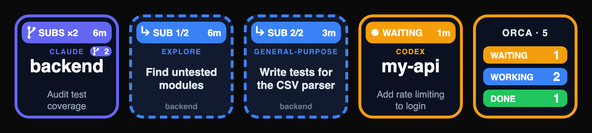
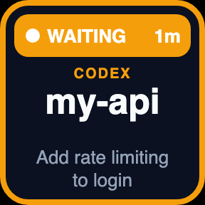
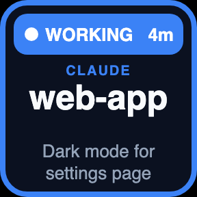
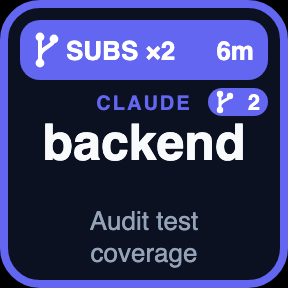
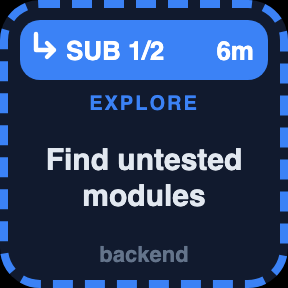
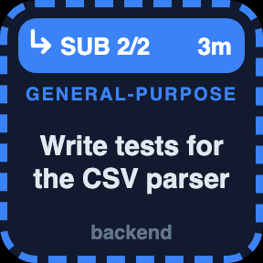
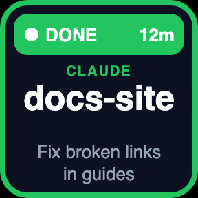
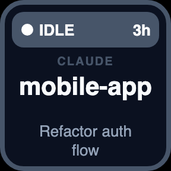
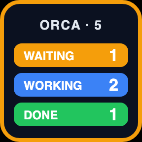
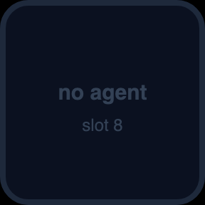

# Stream Dock Orca Agents

> **macOS only.** The plugin reads Orca's macOS data folder, calls the Orca CLI from the macOS app bundle, and ships only a macOS build.

A [Mirabox Stream Dock](https://mirabox.net) plugin that shows the live status of your [Orca](https://orca.stably.ai) AI agents (Claude Code, Codex, ...) on Stream Dock keys. Press a key to jump to that agent's terminal in Orca.

## What you'll see



A row of keys: an agent whose subagents are still running, its two subagent keys, an agent waiting for you, and the **Orca Summary** key.

<table>
<tr><td align="center"><br><sub>WAITING: needs you</sub></td><td align="center"><br><sub>WORKING</sub></td><td align="center"><br><sub>SUBS ×2: own turn over, 2 subagents running</sub></td><td align="center"><br><sub>Subagent key 1/2</sub></td><td align="center"><br><sub>Subagent key 2/2</sub></td></tr>
<tr><td align="center"><br><sub>DONE (last 30 min)</sub></td><td align="center"><br><sub>IDLE</sub></td><td align="center"><br><sub>Orca Summary</sub></td><td align="center"><br><sub>Empty slot</sub></td></tr>
</table>

## Actions

| Action | Shows | Press |
|---|---|---|
| **Orca Agent** | One agent: its status and how long it's been in it, agent type, project, task title, and a small badge with its number of running subagents. Or, on the keys right after it, one running subagent each: `↳ SUB i/n`, its age, type, description and the parent's project (dashed border) | Opens that agent's terminal in Orca. A subagent key opens a live view of that subagent (see below) |
| **Orca Summary** | Total agents, plus how many are waiting, working or done | Jumps to the first agent that needs you (then done, then working) |

### Status colours

| Status | Colour | Meaning |
|---|---|---|
| **WAITING** | amber, blinking border | The agent needs your input or permission |
| **WORKING** | blue | The agent is busy |
| **SUBS ×n** | indigo, fork icon | The agent finished its own turn but n subagents are still running; age counts from the oldest subagent |
| **DONE** | green | The agent finished a turn in the last 30 min |
| **IDLE** | grey | Nothing happening |

Agent keys fill in priority order: waiting, working (incl. SUBS), done, idle. Each agent's running subagents come right after it, oldest first, and disappear when they finish, so later keys shift. Each **Orca Agent** key gets a slot number when you first place it (1st key = slot 1, 2nd = slot 2, ...). The number is saved with the key.

## Requirements

- macOS
- [Orca](https://orca.stably.ai) installed in `/Applications/Orca.app` and running
- Stream Dock app 3.10.191 or newer. It runs the plugin with its built-in Node 20.
- Any Stream Dock device with keys. The layout was designed on an N4 Pro.
- Node.js / npm, used by `install.sh` to install dependencies.

## Install

```sh
git clone https://github.com/OneAtDrt/stream_deck_orca.git
cd stream_deck_orca
./install.sh
```

`install.sh` does three things:
1. Installs dependencies.
2. Copies `com.oneatdrt.orca-agents.sdPlugin` into `~/Library/Application Support/HotSpot/StreamDock/plugins/`.
3. Restarts Stream Dock.

Then, in Stream Dock, drag the actions from the **Orca Agents** category onto your keys.

To update, pull and run `./install.sh` again.

## How it works

Every 2 s the plugin reads two sources:

1. **`orca terminal list --json`:** the live Orca terminals that have an agent (`agentIdentity`).
2. **`~/Library/Application Support/orca/agent-hooks/last-status.json`:** the latest agent hook state for each pane, matched to terminals by `tabId:leafId`.

If a pane has no hook entry, the plugin uses the first character of the Claude Code terminal title instead. A spinner means working and `✳` means idle.

**Subagents.** Orca keeps a roster of each pane's subagents (e.g. Claude Code `Agent`/`Task` subagents) and writes it into the hook entry as `payload.subagents` (`id`, `state`, `startedAt`, `agentType`, sometimes `description`). The plugin shows each entry in state `working`, `blocked` or `waiting` on its own key (`blocked`/`waiting` render as WAITING), and ignores the roster if the entry is older than 30 min (subagent tool calls refresh the parent's entry, so a live subagent keeps it fresh). When Orca gives no description, the plugin reads it from the small `<session>/subagents/agent-<id>.meta.json` file Claude Code writes next to the session transcript (`providerSession.transcriptPath`), cached per file. It never parses the transcript itself. With running subagents, an agent shows WAITING if it needs you, WORKING if it is busy itself, and SUBS otherwise. Orca reports the pane as `working` while any subagent runs, and subagent tool calls update the parent's entry, so "busy itself" means the latest entry is the main agent's own `UserPromptSubmit` / `PreToolUse` / `PostToolUse` (no `toolAgentId`) or the terminal title shows a spinner. The **Orca Summary** key counts main agents only, with SUBS under WORKING.

Pressing a main agent key runs `orca terminal switch --terminal <handle>` and brings Orca to the front. The plugin never reads Orca's auth token.

**Subagent live view.** A Claude Code subagent runs inside its main agent's session and has no terminal of its own, and Orca has no way to open a subagent from outside. So pressing a subagent key opens an Orca terminal tab named `↳ <type> <id>` in the main agent's worktree (`orca terminal create --focus`). The tab runs `plugin/subagent-view.js`, which follows the subagent's transcript (`<session>/subagents/agent-<id>.jsonl`) live and shows its task (▶), what it says, each tool call (⚙) and a shortened result (↳). Pressing the key again switches to the same tab instead of opening another. The tab stays open after the subagent finishes; close it when done. If the view can't be opened, the key falls back to the main agent's terminal.

Overrides (environment variables): `ORCA_BIN`, `ORCA_HOOK_STATUS_FILE`.

## Project structure

| File | Purpose |
|---|---|
| `com.oneatdrt.orca-agents.sdPlugin/manifest.json` | Stream Dock manifest (2 actions) |
| `plugin/index.js` | Stream Dock WebSocket wiring, key slots, refresh loop |
| `plugin/agents.js` | Orca data loading, status logic, sorting, switching to a terminal |
| `plugin/render.js` | 144×144 SVG key images |
| `plugin/subagent-view.js` | Live, readable view of one subagent's transcript, run in an Orca terminal |
| `plugin/agents.test.js` | Unit tests |
| `install.sh` | Installs the plugin into Stream Dock and restarts it |

## Development

```sh
cd com.oneatdrt.orca-agents.sdPlugin/plugin
npm install
npm test
```

Regenerate the README preview images (`docs/previews/`) with `node scripts/previews.js` (needs Google Chrome). It runs made-up sample agents through the real `plugin/agents.js` and `plugin/render.js`.

The plugin writes its log to `plugin/log/plugin.log` inside the installed plugin folder.

## Version history

See [CHANGELOG.md](./CHANGELOG.md).
